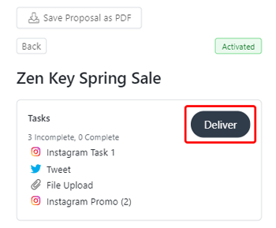

## About this article

A procedural article describing how influencers could submit their social media content before posting on social media so their collaborating brands could approve it. Influencers would submit their content through the product’s influencer portal, the **Live Site.** This article assumed these influencers had experience working with brands as well as some previous knowledge about the Live Site’s features and functionality.

I included this article because this task had two challenges:

1. Influencers needed to leave the process and come back later to check if their collaborating brand approved their content. There was an interim UI that displayed the influencer’s submission history that had useful information, but it did not fit naturally into the approval procedure as a step. I needed to decide how to showcase this information.
2. Influencers may need to repeat this process several times until the brand approves their content. I needed to make this clear to audiences.

This article is available publicly, so nothing has been redacted in the sample. You can view the current version [on their site.](https://help.grin.co/v1/docs/submitting-content-for-approval)

## Submitting content for approval

Your brand sometimes may require you to get your content approved before posting it, which means you’ll need to upload it to the Live URL. Once your content is ready, you can submit it for approval to your brand via your program proposal. Then, your brand will be notified that your content is ready for their review.

### What you’ll need

* A Live Site. If you don’t have a Live Site, contact the brand you’re working with so they can generate one for you.
* An accepted proposal with tasks requiring approval for an Activation. Submitting a proposal means you’ve accepted the brand’s requirements and are officially part of the Activation. For more information, see our help article Submitting a Proposal.
* The content you’re submitting ready for file upload

## How to do it

1. Navigate to your **Live Site.**
2. Select **View** on the Activation you’re submitting content for. This will open your proposal for the Activation.
3. In the **Tasks** module, select **Deliver.**

4. Select **View** on the task you need to submit content for. Content that requires approval will be labeled.

5. If the task has two or more deliverables, select which deliverable you're submitting content for approval. Otherwise, skip to **Step 6.**
6. Select **Upload File** to upload your post. If the brand wants to approve your **caption** (which includes your post's description, hashtags, or mentions), enter that as well.
7. Select **Submit for Approval.** This will let the brand know that your content is ready for them to review.

:::info[Note]

Once your brand has reviewed your content, you’ll get an email notification at the address you provided in your Live Site’s **Settings.** Be sure to have your preferred email set! For more information on updating your settings, see our help article [Managing Settings.](https://help.grin.co/docs/managing-settings)

You can always return to the deliverables page to view your approval status, view your submission history by pressing **View History,** and view your most recent submission. Once your brand reviews your content, you’ll see a new status, either **Needs Changes** or **Approved,** on your submission.

:::

8. After your brand has reviewed your content, return to your task using **Steps 2-5** and view your submission. Depending on its status, you'll need to do different things:
    1. If it's marked **Needs Changes,** revise your content according to your brand's feedback, then press **Edit Upload** and repeat **Steps 6-7.**
    2. If it's marked **Approved,** your brand is happy with your content, and the approval process is completed.

That’s it! Your content has been approved for posting by your brand. Be sure to check if there’s an agreed upon post date. Otherwise, you can post your content to your social networks whenever you’re ready.